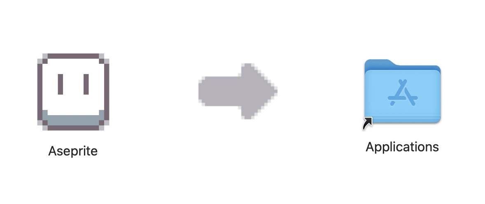

# Aseprite build and install on macos

[中文](README.md) | [English](README.en.md)

Build free Aseprite on MacOS

QQ Group：1031983069

Update Date: 2025-03-24

Support Aseprite 1.3.9.1

Test on MacOS 15.3.2
* x86_64 ✅
* arm64 ✅

## Preinstall

* xcode: https://apps.apple.com/app/xcode/id497799835?mt=12
* brew: https://brew.sh/
* ruby 3+

## Use

`$ ./install.rb`

## Ref

* https://github.com/aseprite/aseprite/blob/main/INSTALL.md#compiling
* https://en.bioerrorlog.work/entry/build-aseprite-source-code
* https://gist.github.com/allangarcia/938b052a7d55d1652052e4259364260b

# The End

* [Weclome Feedback](https://github.com/Mark24Code/aseprite-build-and-install-on-macos/issues/new)
* Email: mark.zhangyoung@qq.com

----

Buy me a coffee ~ 🥳 

Wechat Pay

Alipay

