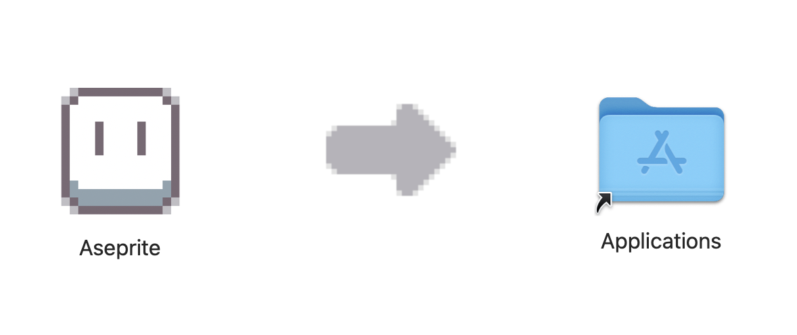

# Aseprite build and install on macos

[中文](README.md) | [English](README.en.md)

在 MacOS 上构建免费的 Aseprite

QQ 交流群：1031983069

更新日期: 2025-03-24

支持 Aseprite 1.3.9.1

测试 MacOS 15.3.2
* x86_64 ✅
* arm64 ✅

# 中文说明

## 预先安装

* xcode: https://apps.apple.com/app/xcode/id497799835?mt=12
* brew: https://brew.sh/
* ruby 3+

## 使用

下载项目，命令行输入执行

`$ ./install.rb`

> ⚠️ 注意
> * 中间有个过程会遇到协议界面，只需要输入 q 退出即可继续流程
> * 中间可能需要输入密码，输入回车即可继续流程

## 参考

* https://github.com/aseprite/aseprite/blob/main/INSTALL.md#compiling
* https://en.bioerrorlog.work/entry/build-aseprite-source-code
* https://gist.github.com/allangarcia/938b052a7d55d1652052e4259364260b

# 最后

到这里看来已经解决了您的问题。可以愉快的使用 Aseprite！让我们 🍻

后续，如果您遇到了使用问题，可以：

* [如果遇到了问题、建议 可以点击这段文字创建一个 Github Issue 给我，我会尽可能的答复](https://github.com/Mark24Code/aseprite-build-and-install-on-macos/issues/new)
* 发邮件给我 mark.zhangyoung@qq.com

----

如果您觉得帮到您了，节省了大量时间。可以请作者喝杯可乐~ 🥳 

微信

支付宝

